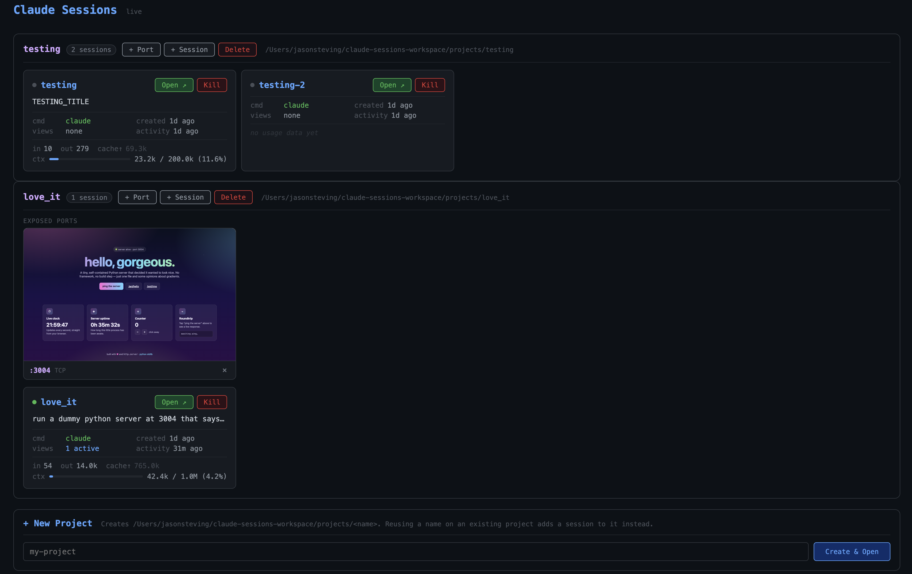

# claude-sessions

A dashboard for managing multiple persistent Claude Code sessions across multiple
project directories, all running safely inside a Docker microvm sandbox. Each
session is a `tmux` session attached to a `ttyd` web terminal; a FastAPI app
proxies the WebSockets so only a single host port is exposed. The whole stack
runs inside an `sbx` sandbox, which is the trust boundary that makes it safe to
launch Claude with `--dangerously-skip-permissions` on your behalf.



## Prerequisites

These must already be installed on the host machine:

- **Docker** — runtime for the `sbx` sandbox
- **`sbx` CLI** — Docker Sandboxes
  (<https://docs.docker.com/ai/sandboxes/>)
- **`just`** — the command runner used to drive the project
- **`uv`** — Python package manager. Needed on the host to run the port
  daemon (see [Exposing ports](#exposing-ports)), and also used inside the
  sandbox to run the dashboard server.

> [!NOTE]
> **TODO:** `just up` should detect missing host prerequisites (`docker`,
> `sbx`, `just`) up front and print a clear, actionable error pointing at
> the install docs — rather than failing somewhere mid-recipe with a cryptic
> `command not found`.

Inside the sandbox, `just up` will `apt-get install` `just`, `tmux`, and `ttyd`
on first run if they're missing.

> [!NOTE]
> **TODO:** replace the runtime `apt-get install` step with a purpose-built
> sbx sandbox template that ships `just`, `tmux`, and `ttyd` pre-installed.
> The current bootstrap costs ~30s on first `just up` and depends on the
> sandbox's apt mirror being reachable; a baked template would make session
> startup deterministic and offline-friendly.

## Quickstart

```bash
git clone <repo-url> claude-sessions
cd claude-sessions
cp .env.example .env   # or create .env from the template below
just up
```

Then open <http://127.0.0.1:3000> (or `127.0.0.1:$PORT`).

### `.env`

```bash
# Required
SANDBOX_NAME=claude-sessions
SANDBOX_DIR=/path/to/your/workspace

# Optional
PORT=3000        # dashboard port (default 3000)
HOST_PORT=33001  # host daemon port for dynamic port exposure (default 33001)
TAILSCALE=1      # opt-in tailnet serve for phone access (default off)
```

- `SANDBOX_NAME` is the `sbx` sandbox identifier. Any string; created on first
  `just up` if it does not yet exist.
- `SANDBOX_DIR` is an absolute host path used as the sandbox's read-write
  workspace. Per-project session directories live at `$SANDBOX_DIR/projects/`,
  so any files Claude generates inside a session are visible on the host (you
  can open them in your IDE, commit them, etc.).
- **`SANDBOX_DIR` must not be the codebase directory.** `just up` aborts if you
  set them to the same path. The codebase is mounted read-only; the workspace
  must be a separate writable location.

## Operating commands

All commands are recipes in `justfile`.

### `just up`

Idempotent bring-up. In order:

1. Creates the sandbox if it doesn't exist (`sbx create --name $SANDBOX_NAME
   claude $SANDBOX_DIR <code-dir>:ro`).
2. Installs `just`, `tmux`, and `ttyd` inside the sandbox if missing.
3. Launches the server inside the sandbox via a backgrounded `sbx exec`
   (disowned from the shell so it survives `just up` exiting). The host-side
   exec process is what keeps the sandbox from being auto-stopped by `sbx`.
4. Publishes the dashboard port: `sbx ports $SANDBOX_NAME --publish $PORT:$PORT`.
5. Starts the **host daemon** (`host_daemon.py`) on `127.0.0.1:$HOST_PORT`.
   This process — and only this process — invokes `sbx ports --publish` for
   ports the user requests via the dashboard. See [Exposing ports](#exposing-ports).

Safe to re-run; each step is a no-op if already done.

### `just down`

Clean shutdown. SIGTERMs the host daemon first so it can unpublish every
managed port; then kills the in-sandbox server (`fuser -k $PORT/tcp`),
terminates the host-side `sbx exec` sessions (which allows `sbx` to
auto-stop the sandbox), and unpublishes the dashboard port. Idempotent.

### `just restart`

`down` followed by `up`.

### `just status`

Shows running host-side `sbx exec` processes, the sandbox row from `sbx ls`,
and the currently-published ports for the sandbox.

### `just logs`

`tail -f /tmp/sbx-serve.log` — the host-side capture of the in-sandbox server's
stdout/stderr.

### `just logs-host`

`tail -f /tmp/host-daemon.log` — the host-side port daemon's stdout/stderr.

## Exposing ports

Each project card in the dashboard has a **+ Port** button. Use it to publish
a port from the sandbox to `127.0.0.1` on the host so a server Claude built
in that project (a dev server, a database, anything bound to `0.0.0.0`
inside the sandbox) is reachable from your browser at `http://127.0.0.1:<port>`.

### Trust model

`sbx ports --publish` can only be invoked from the host. The naive design
would be to have the sandbox dashboard call out to a host-side helper —
but that creates a control plane the sandbox can drive, which is exactly
what we're trying to avoid (Claude runs with `--dangerously-skip-permissions`,
and anything Claude can run inside the sandbox could then arbitrarily
expose host ports).

So the sandbox and the host daemon **never communicate**. The browser is the
trusted bridge:

- The dashboard HTML is served by the sandbox at `http://127.0.0.1:$PORT`.
- The dashboard's JS calls the host daemon at `http://127.0.0.1:$HOST_PORT`
  directly to add or remove ports.
- The host daemon binds **loopback only**. Its CORS config allows only the
  dashboard's origin, and writes require `Content-Type: application/json`
  so cross-origin requests trigger a preflight that other sites can't pass.
- The sandbox has no way to reach the host daemon — there is no network
  path back from inside the sandbox to a loopback-bound host process.

The host daemon persists state at `$SANDBOX_DIR/.host-daemon-state.json`.
On startup it reconciles published ports against that state (recovering
orphans from a hard crash); on graceful shutdown (`just down`) it
unpublishes everything it owns and clears the state file — the processes
the ports pointed at are about to die anyway.

### Tailscale: mobile access

Set `TAILSCALE=1` in `.env` to make every exposed port — plus the dashboard
and the host daemon itself — reachable on your tailnet, so the dashboard
works from your phone. When set, `just up`:

- runs `tailscale serve --http=$PORT http://localhost:$PORT` for the
  dashboard,
- runs the same for the host daemon at `$HOST_PORT`, and
- has the host daemon do the same for every user-exposed port as it's
  added (and tear it down on remove).

`just down` cleans up all of those serves. Failures (Tailscale not
installed, not logged in, etc.) are logged but never block local
operation — the dashboard stays fully usable on `127.0.0.1` regardless.

The daemon also widens its CORS policy to accept `*.ts.net` origins when
`TAILSCALE=1` is set; without it, the regex stays loopback-only.

**Prerequisites — you must have already done these on the host before
setting `TAILSCALE=1`:**

1. **Install Tailscale** and sign in to your tailnet (`tailscale up`).
   Verify with `tailscale status` — your machine should be listed.
2. **Enable the `tailscale serve` feature for your tailnet.** This is a
   one-time tailnet-level setting, not something `just up` can do for
   you. In the [Tailscale admin console](https://login.tailscale.com/admin/dns):
   - Enable **MagicDNS** (if not already on).
   - Enable **HTTPS Certificates** — even though we use `--http=` and
     never request a cert, the admin console gates the entire `tailscale
     serve` subsystem behind this toggle.
   See [Tailscale's `serve` docs](https://tailscale.com/kb/1242/tailscale-serve)
   for the full setup walkthrough.
3. **Confirm `tailscale serve` works at all** before flipping the flag.
   Try `tailscale serve --http=8080 http://localhost:8080` against any
   local server; if it errors out, fix that before enabling `TAILSCALE=1`
   here. `just up` is forgiving about failures (it'll print a warning and
   keep going on loopback-only), but it can't diagnose them for you.

Once those are in place, `tailscale status` will show your tailnet
hostname; the phone URL is `http://<hostname>:$PORT`.

## Security model

- Sessions launch `claude --dangerously-skip-permissions`, which would normally
  be a footgun. It is only safe here because **everything runs inside the
  `sbx` microvm**. `main.py`'s `_require_sandbox()` guard refuses to start if
  `$SANDBOX_VM_ID` is unset, so the server cannot accidentally be run on the
  host. The same check requires `$SANDBOX_DIR` to be set.
- The dashboard binds to `0.0.0.0:$PORT` *inside* the sandbox. `sbx ports
  --publish` exposes it on the host as `127.0.0.1:$PORT` (loopback only), so
  it is not reachable from other machines on your LAN unless you explicitly
  forward it (see the Tailscale section below).
- The codebase is mounted **read-only** into the sandbox; `$SANDBOX_DIR` is
  mounted read-write. Files Claude creates in `$SANDBOX_DIR/projects/<name>/`
  are visible on the host so you can open, edit, and commit them with your
  usual tools.
- The per-session `ttyd` instances bind to `127.0.0.1` inside the sandbox.
  They are not directly reachable from the host; the FastAPI app is the only
  entry point and it WebSocket-proxies traffic to the right `ttyd` based on
  the URL path.

## Claude Code on your phone, on your hardware

This is the part that makes the whole project worth it. Once your Mac is on a
[Tailscale](https://tailscale.com) tailnet, set `TAILSCALE=1` in `.env` and
`just up` exposes everything to every device you own — phone, tablet,
second laptop — without opening a public port. The dashboard, the host
daemon, and every port the dashboard publishes are all served on the
tailnet at their respective ports (see [Tailscale: phone access](#tailscale-phone-access)
above for the mechanics).

Open the tailnet URL on your phone and you have full-fidelity Claude Code
in a browser tab, running on your hardware, with every session
state-resumable from anywhere — and any server Claude builds inside a
project is one tap away on the same screen.

The trust boundary stays clean: Tailscale terminates on your Mac, the Mac
forwards over loopback into the sandbox, and the sandbox never sees a
Tailscale credential. Devices that are *not* on your tailnet cannot reach
the dashboard at all.

### Why this matters

This setup gives you things that neither Anthropic's hosted Claude Code
sandbox nor the desktop-dispatch / remote-control feature in the mobile app
can:

- **Your hardware, your code.** Files Claude creates live in
  `$SANDBOX_DIR/projects/<name>/` on your Mac, ready to open in your IDE or
  commit to git. Nothing is locked inside someone else's cloud sandbox.
- **Long-running side effects.** Because the sandbox keeps running, Claude
  can spin up a dev server, a database, or a background worker that you can
  also reach over your tailnet for as long as you want. The hosted Claude
  Code sandbox tears itself down between turns; this one doesn't.
- **Claude built me a web app, and now it serves it to me.** With
  `TAILSCALE=1`, any port the dashboard exposes is immediately reachable
  on your phone over the same tailnet ingress — letting Claude build you a
  tool and serve it back, persistently, over a network only your devices
  can reach. That's a workflow neither the cloud sandbox nor the mobile
  remote control supports.

## Architecture

```
browser (loopback OR tailnet)
  │  http://(127.0.0.1 | <host>.<tailnet>.ts.net):$PORT       (dashboard / sessions / ttyd proxy)
  │  http://(127.0.0.1 | <host>.<tailnet>.ts.net):$HOST_PORT  (ports API — host daemon only)
  ▼
host (macOS)
  ├─ tailscale serve  (only when TAILSCALE=1; forwards tailnet → loopback)
  │
  ├─ host_daemon.py  (127.0.0.1:$HOST_PORT)
  │     • only process that invokes `sbx ports --publish/--unpublish`
  │     • also runs `tailscale serve` per published port when TAILSCALE=1
  │     • state: $SANDBOX_DIR/.host-daemon-state.json
  │     • sandbox cannot reach this — browser is the only client
  │
  └─ sbx microvm ($SANDBOX_VM_ID)         ↑
       │                                  │  sbx ports --publish
       ├─ FastAPI app (main.py, 0.0.0.0:$PORT)
       │     • routes:    /  /partial/groups  /sessions  /sessions/{n}/{kill,ws,*}
       │     • WS proxy:  /sessions/{n}/ws  →  ws://127.0.0.1:<ttyd-port>/ws
       │
       ├─ per-session ttyd  (127.0.0.1:<ephemeral>, --writable)
       │     → tmux attach-session -t <name>
       │
       └─ per-session tmux  (cd $SANDBOX_DIR/projects/<name> && claude …)
```

- Session metadata persists in SQLite at `/home/agent/.session-manager.db`
  inside the sandbox. Schema: `name PRIMARY KEY, project, project_dir,
  created_at, claude_project_key, claude_session_id`.
- Live ttyd process state (port + pid + open connection count) is held only
  in memory; on server restart it's re-created on demand.
- Token and context usage are scraped from Claude's own
  `~/.claude/projects/<project-key>/<session-id>.jsonl` files. After a
  session is launched, a 30-second background task watches that directory for
  the new file Claude writes, then records the project key / session id back
  to the DB so subsequent scrapes can find it.
- The custom title is the most recent `custom-title` entry (written by
  `/rename`). If absent, the title falls back to the first user message
  that isn't a Claude Code internal tag (`<bash-input>`, `<command-name>`,
  etc.).

## Troubleshooting

### Browser shows "site can't be reached"

Check that the port is actually published:

```bash
sbx ports $SANDBOX_NAME
```

If nothing is published, `just up` again. If something is published but the
browser still can't connect, use `127.0.0.1` explicitly in the URL — on
macOS, `localhost` often resolves to `::1` (IPv6) while `sbx --publish`
binds IPv4, so `http://localhost:3000` may silently fail while
`http://127.0.0.1:3000` works.

### `refusing to start: $SANDBOX_VM_ID is not set`

You're running `main.py` (or `just _serve`) outside the sandbox. That guard
is intentional — Claude is launched with `--dangerously-skip-permissions`,
which is only safe inside the microvm. Use `just up` instead, which `exec`s
the server inside the sandbox.

### Stale state from a previous run

```bash
just down && just up
```

If the sandbox itself is in a bad state, delete and recreate it:

```bash
sbx rm $SANDBOX_NAME   # (use whatever command your sbx version exposes)
just up
```

`just up` will recreate it from scratch, including re-installing
`just`/`tmux`/`ttyd`.

### Server is running inside the sandbox but unreachable from the browser

`sbx` auto-stops sandboxes shortly after the last connected `sbx exec`
session goes away. The host-side `sbx exec $SANDBOX_NAME` process that
`just up` backgrounds is what keeps the sandbox alive. Check for it:

```bash
pgrep -af "sbx exec $SANDBOX_NAME"
```

If there's no matching process, the sandbox may have auto-stopped under
you. Run `just up` to bring it back. (`just status` summarises this plus
the sandbox state and published ports in one shot.)
